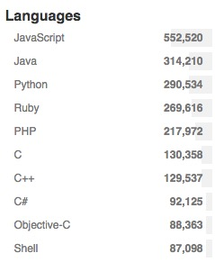
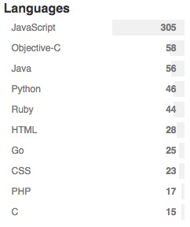
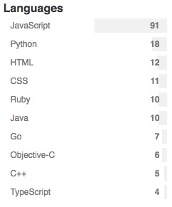

# Projects on Github
Here is a statistics on public Github, there are more and more projects increased every day. *(Searched at May 29, 2016)*

We can see javascript's projects are much more than others, why? These years more and more people become FE engineers, and javascript can run on back-ends even hardware. Maybe the most important thing is its special charactor.

1. Star > 0;

2. Star > 1000;

3. Star > 5000;

4. Star > 10000;

