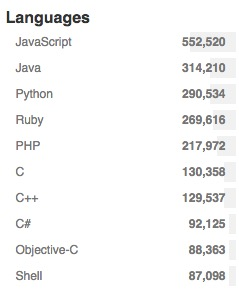
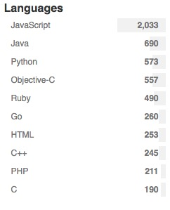
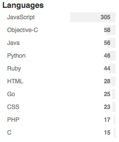
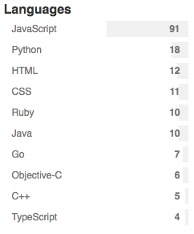

# Projects on github.

Here is a statistics on public Github, there are more and more projects increased every day. _\(Searched at May 29, 2016\)_

We can see javascript's projects are much more than others, why? These years more and more people become FE engineers, and javascript can run on back-ends even hardware. Maybe the most important thing is its special charactor.

1. Star &gt; 0;

1. Star &gt; 1000;

1. Star &gt; 5000;

1. Star &gt; 10000;

